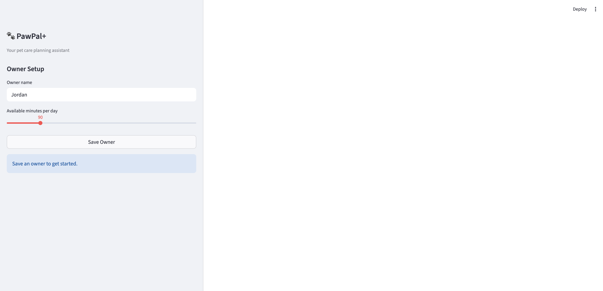
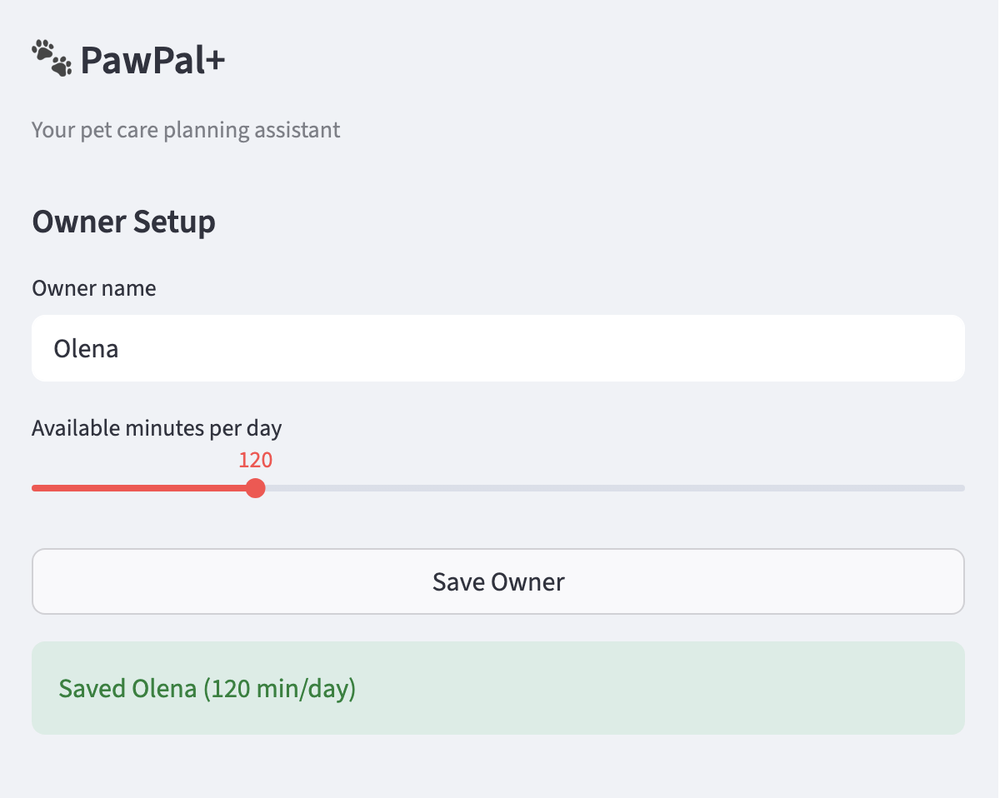
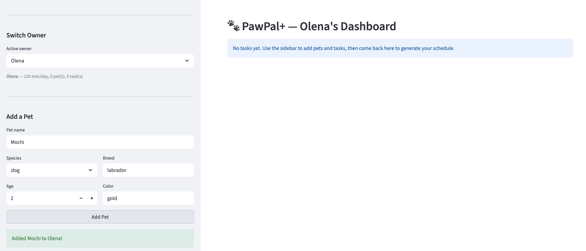
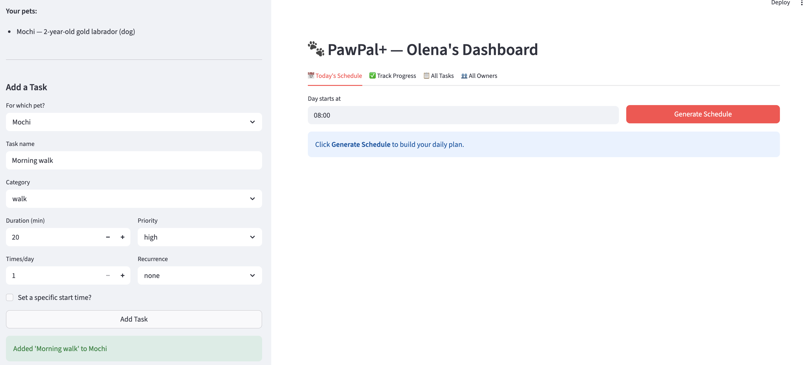
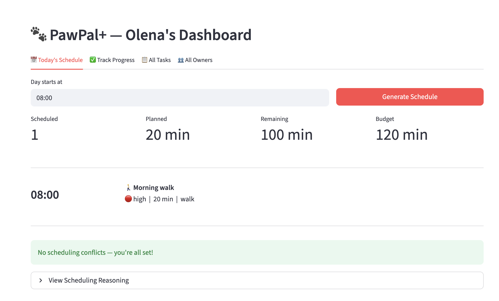
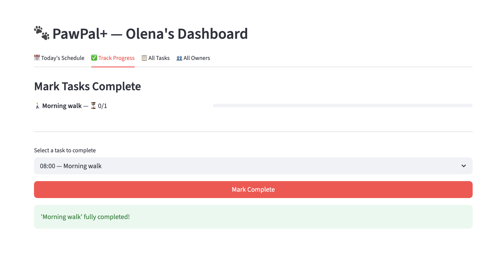
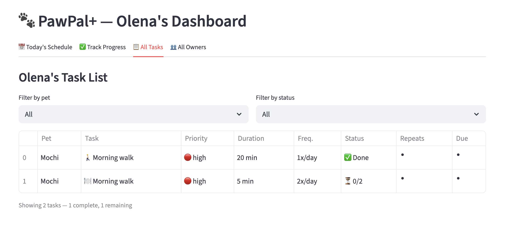
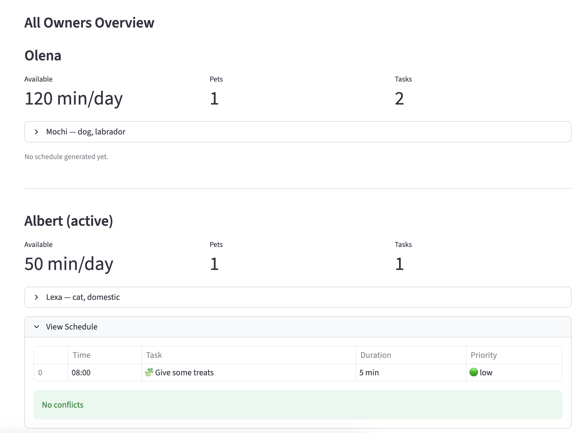

# PawPal+ (Module 2 Project)

You are building **PawPal+**, a Streamlit app that helps a pet owner plan care tasks for their pet.

## Scenario

A busy pet owner needs help staying consistent with pet care. They want an assistant that can:

- Track pet care tasks (walks, feeding, meds, enrichment, grooming, etc.)
- Consider constraints (time available, priority, owner preferences)
- Produce a daily plan and explain why it chose that plan

Your job is to design the system first (UML), then implement the logic in Python, then connect it to the Streamlit UI.

## What you will build

Your final app should:

- Let a user enter basic owner + pet info
- Let a user add/edit tasks (duration + priority at minimum)
- Generate a daily schedule/plan based on constraints and priorities
- Display the plan clearly (and ideally explain the reasoning)
- Include tests for the most important scheduling behaviors

## Features

### Scheduling Engine
- **Priority-based scheduling** — Tasks are sorted by priority (high, medium, low) using a dictionary lookup (`PRIORITY_ORDER`), then packed into the owner's available time budget. Tasks that don't fit are moved to an unscheduled list with an explanation.
- **Preferred start times** — Users can optionally pin a task to a specific time (e.g., "meds at 12:00"). The scheduler honors the preferred time and fills remaining gaps automatically.
- **Sorting by time** — After scheduling by priority, `sort_by_time()` reorders the plan chronologically using a lambda key that converts "HH:MM" strings to minutes for correct numerical ordering.
- **Conflict detection** — `detect_conflicts()` compares every pair of slots using interval overlap logic (`start_a < end_b and start_b < end_a`), calculates the exact overlap in minutes, and returns actionable warnings. Same-task occurrences are skipped to avoid false positives.

### Task Management
- **Daily and weekly recurrence** — Tasks can recur on a `"daily"` or `"weekly"` schedule. When all occurrences are marked complete, `create_next_occurrence()` uses `timedelta` to advance the due date and creates a fresh task with `is_completed` reset to 0.
- **Multi-frequency tracking** — A task with `frequency=3` requires three separate completions before it's considered done. `mark_complete()` increments a counter capped at the frequency to prevent over-completion.
- **Task filtering** — `filter_tasks()` queries across all pets by name and/or completion status with case-insensitive matching.

### User Interface
- **Multi-owner support** — Multiple owners are stored in a session-state registry. A sidebar dropdown switches between owners, each with their own pets, tasks, and generated schedule.
- **Tabbed dashboard** — The main area is split into four tabs: Today's Schedule (visual timeline cards with metrics), Track Progress (progress bars and mark-complete), All Tasks (filterable table), and All Owners (side-by-side overview).
- **Visual feedback** — Priority icons (red/yellow/green), category icons, `st.metric` cards, `st.progress` bars, `st.error` blocks for conflicts with actionable tips, and `st.balloons()` on task completion.
- **Scheduling reasoning** — Every scheduling decision (scheduled or dropped) is logged and viewable in an expandable section.

## Demo

### Owner Setup
Create an owner with a name and daily time budget using the sidebar slider.

<a href="demo-1.png" target="_blank"></a>

### Saving an Owner
After clicking Save Owner, a confirmation appears with the owner's time budget.

<a href="demo-2.png" target="_blank"></a>

### Adding a Pet
Switch between owners in the sidebar, then add pets with species, breed, age, and color.

<a href="demo-3.png" target="_blank"></a>

### Adding Tasks
Add tasks with duration, priority, frequency, recurrence, and an optional preferred start time.

<a href="demo-4.png" target="_blank"></a>

### Generated Schedule
The Today's Schedule tab shows metric cards and a visual timeline sorted chronologically.

<a href="demo-5.png" target="_blank"></a>

### Tracking Progress
The Track Progress tab shows progress bars per task and lets you mark tasks complete.

<a href="demo-6.png" target="_blank"></a>

### All Tasks View
The All Tasks tab provides a filterable table with status icons and a summary count.

<a href="demo-7.png" target="_blank"></a>

### All Owners Overview
The All Owners tab shows every owner's metrics, pets, and schedules side by side.

<a href="demo-8.png" target="_blank"></a>

## Getting started

### Setup

```bash
python -m venv .venv
source .venv/bin/activate  # Windows: .venv\Scripts\activate
pip install -r requirements.txt
```

### Suggested workflow

1. Read the scenario carefully and identify requirements and edge cases.
2. Draft a UML diagram (classes, attributes, methods, relationships).
3. Convert UML into Python class stubs (no logic yet).
4. Implement scheduling logic in small increments.
5. Add tests to verify key behaviors.
6. Connect your logic to the Streamlit UI in `app.py`.
7. Refine UML so it matches what you actually built.

## Testing PawPal+

### Running the tests

```bash
python -m pytest tests/test_pawpal.py -v
```

### What the tests cover

The test suite in `tests/test_pawpal.py` includes **17 tests** across four areas:

- **Task completion** — Verifies `mark_complete()` increments correctly, caps at the task frequency, and tracks `is_fully_done()` status.
- **Pet task management** — Confirms adding tasks to a pet updates its task list.
- **Sorting correctness** — Ensures `sort_by_time()` returns slots in chronological order, handles duplicate start times without data loss, and works on an empty plan.
- **Recurrence logic** — Validates that completing a daily task creates a new task due the next day, weekly tasks advance by 7 days, non-recurring tasks produce no next occurrence, multi-frequency tasks require all completions before recurring, and a missing `due_date` returns `None` safely.
- **Conflict detection** — Checks that overlapping slots are flagged with the correct overlap duration, identical start times are caught, adjacent (non-overlapping) slots produce no warnings, and an empty plan returns cleanly.
- **Scheduling edge cases** — Tests a pet with no tasks, an owner with zero available minutes, and a budget that exactly fits all tasks (boundary condition).

### Confidence Level

**4 out of 5 stars** — The core scheduling, sorting, recurrence, and conflict detection logic is well covered with both happy-path and edge-case tests. The one star is withheld because the test suite does not yet cover the Streamlit UI layer, multi-pet cross-priority scheduling, or integration between `generate_plan()` and `detect_conflicts()` in sequence.
